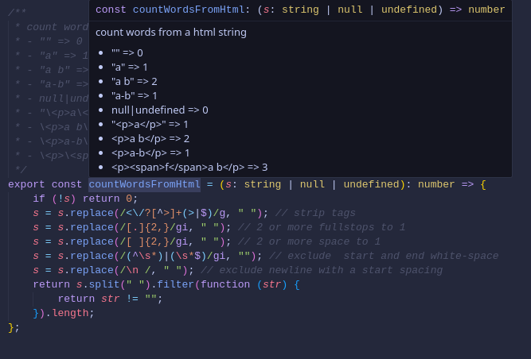
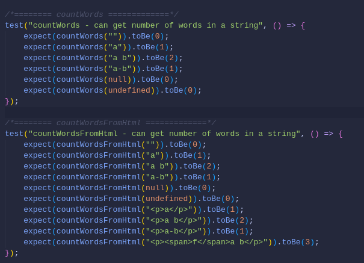

# AceLords Node Utils
Common utils for your node, Javascript, and Typescript projects.

### Why this library?
This libray focuses more on presentation aspects, not to be used in business logic. 
Different frameworks/libraries render `null`, `undefined` and `0` differently 
> NB e.g. in svelte, `null` is rendered as `"null"` in this template `{functionThatReturnsNull(null)}` and as such would be such a hasle writing multiple `#if` for checking `null` (or even `{functionThatReturnsNull(null) ?? ""}`). It would be nice to just have `{functionThatReturnsNullAsString(undefined)}` for improved `DX` don't you agree?

Most functions are meant to be uses only in the `Presentation layer`. Use them sparingly in the `Business logic layer`.

#### Sample results from the docs on hover


#### Tests for quick reference


## Installation
Install via `npm`

```bash
npm i @acelords/js-utils

pnpm i @acelords/js-utils
```

## Docs
Available functions. [View the entire list here](https://github.com/acelords/node-utils/blob/main/src/index.ts)
- formatDate()
- formatDateTime()
- getTimeFromDate()
- randomNumber()
- randomString()
- isNumeric()
- fromNow()
- daysDiff()
- daysFromNow()
- dateDiff()
- substring()
- numberFormat()
- formatNumber()
- formatCurrency()
- slugify()
- stripTags()
- stripHtml()
- plural()
- singular()
- pluralize()
- insertIntoArray()
- getMonthNameFromSqlMonthIndex()
- isPhoneNumber()
- isEmail()
- isEmpty()
- ucwords()
- capitalize()
- camelCase()
- camelCaseToSentenceCase()
- snakeCaseToSentenceCase()
- kebabCaseToSentenceCase()
- kebabCaseToPascalCase()
- kebabCase()
- scrollToTop()
- countWords()
- countWordsFromHtml()
- birthdayFromNow()
- isPhoneNumber()
- getRandomElementsFromArray()
- isChristmasTime()
- boolean()
- isBooleanable()
- ordinalSuffix()
- nthNumber()
- generateStrongPassword()
- getInitials()


## Sample Usages
- Format a number value in human-readable way: <br />
    `<p>Clicked {formatNumber(978345, true)} times.</p>` <br />
    `<p>Clicked 978,345 times.</p>`<br />
    `<p>Clicked {formatNumber(null|undefined|"", true)} times.</p>` <br />
    `<p>Clicked times.</p>`<br />
    `<p>Clicked {formatNumber(null|undefined|"" ?? 0, true)} times.</p>` <br />
    `<p>Clicked 0 times.</p>`
    `<p>Clicked {formatNumber(null|undefined|"" ?? "0", true)} times.</p>` <br />
    `<p>Clicked 0 times.</p>`<br />
    `<p>Clicked {formatNumber(null|undefined|"" ?? "1000", true)} times.</p>` <br />
    `<p>Clicked 1,000 times.</p>`<br />
    `<p>Clicked {formatNumber("abc", true)} times.</p>` <br />
    `<p>Clicked times.</p>`

- Format currency saved in cents (as you should) in human-readable way (`Int|BigInt|Float` also supported):<br />
    `<p>Costs ${formatCurrency(132949)} only.</p>`<br />
    `<p>Costs $1,329.49 only.</p>`<br />
    `<p>Costs ${formatCurrency(null|undefined|"")} only.</p>`<br />
    `<p>Costs $ only.</p>`<br />
    `<p>Costs ${formatCurrency(null|undefined|"" ?? "0")} only.</p>`<br />
    `<p>Costs $0.00 only.</p>`<br />
    `<p>Costs ${formatCurrency(null|undefined|"" ?? 0)} only.</p>`<br />
    `<p>Costs $0.00 only.</p>`<br />
    `<p>Costs ${formatCurrency(null|undefined|"" ?? 1099)} only.</p>`<br />
    `<p>Costs $10.99 only.</p>`<br />
    `<p>Costs ${formatCurrency("abc")} only.</p>`<br />
    `<p>Costs only.</p>`

- Count apples sold by the doctor: <br />
    `<p>You have sold {formatNumber(3454, true)} {pluralize('apples', applesCount)} today.</p>`<br />
    `<p>You have sold 3,454 apples today.</p>` <br />
    `<p>You have sold 1 apple today.</p>` <br />
    `<p>You have sold 0 apples today.</p>`


## Dev Notes
### Testing
```bash
npm t
```

### Publish to NPM
Before publishing, remember to INCREMENT Versioning (in `package.json`) and also BUILD it

```bash
npm run build && npm publish --access public 
```
